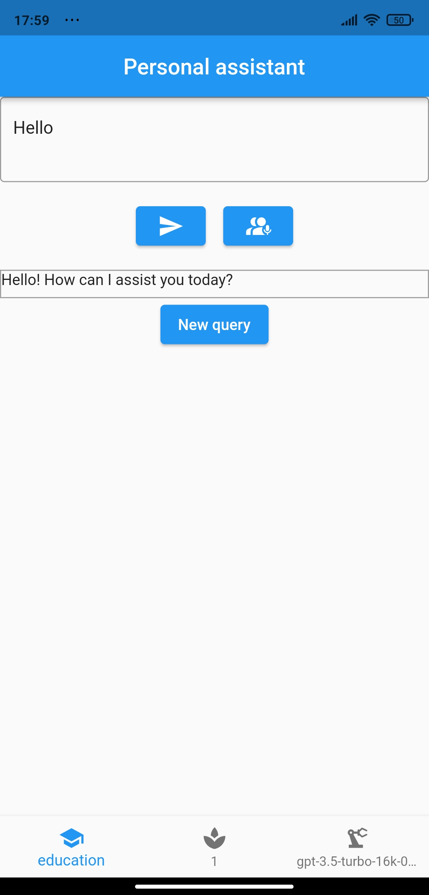

# Flutter Personal Assistant

This is a Flutter based app that acts like a personal assistant and educator which uses OpenAI's GPT Chat API. It is designed to mimic as an assistant but with different mode of conversations/learning such as kids-boys-10y, kids-girls-13y, short, normal and education. It includes option for voice prompts and assistant's response are based on set of labels which includes 'mode', 'creativity' and 'model'.

## Features

- Choice to select mode with Five options: Kids-Boys, Kids-Girls, Short, Normal, Education.
- Voice prompt feature
- Flexibility to adjust creativity using slider.
- Selection of OpenAI GPT model.
- Real-time updates of the conversation history.

### Screenshots
<div style="display: flex; justify-content: center; align-items: center;">
  
</div>


## Installation

1. Clone the repository:

   ```shell
   git clone https://github.com/your-username/your-repository.git
   ```

2. Navigate to the project directory:

   ```shell
   cd your-repository
   ```

3. Install the required dependencies:

   ```shell
   flutter pub get
   ```

4. Create a `.env` file at the root of the project and add your OpenAI API key:

   ```
   OPENAI_API_KEY=your-api-key
   ```

5. Run the app:

   ```shell
   flutter run
   ```

## User Guidelines

1. You can begin by typing in your query in the text-field. Hint: Double click to clear the field.
2. Click on Send or use Voice Interpreter feature represented with an Icon.
3. The response from AI assistant will be visible below Text Input Field.
4. Use Bottom Navigation bar to switch labels and update parameters about mode, creativity and model.
5. For new query, click on 'New Query' button.

## Dependencies

- flutter_dotenv: ^5.0.0
- permission_handler: ^14.0.0
- record: ^3.0.0
- audioplayers: ^0.20.0
- path_provider: ^2.0.0

